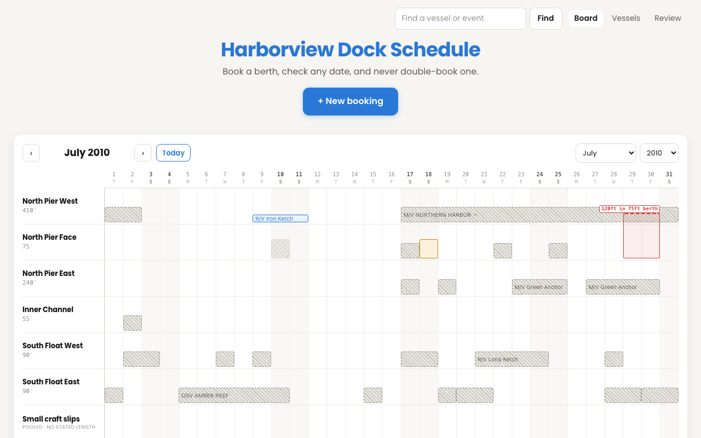

# Harborview Dock Schedule

Berth reservation management for a marine research facility.

**Live:** https://berth-scheduler.vercel.app



Replaces a spreadsheet in which double-bookings were caught by eye and vessel/berth size
was not checked at all.

## Try it in two minutes

Everything on the board is from the workbook you sent. Nothing is invented.

1. **Open [July 2010](https://berth-scheduler.vercel.app/?y=2010&m=7).** The red bar
   breaking out of North Pier Face is R/V CLEAR TERN, 120ft in a 75ft berth — one of nine
   physically impossible assignments in your 23 years. A bar's height is vessel length ÷
   berth length, so a misfit is geometry, not a badge you have to learn.
2. **Book something, then book it again.** Back on today, press **+ New booking**, type any
   vessel name and save. Press **+ New booking** again: it opens on the same berth and
   day, so the verdict is red, Save is off, and it names the booking in the way. The
   database refuses the write, and there is no override. **Find me a berth** proposes a
   free one and says why. Cancel your booking when you are done; Review can restore it.
3. **Open Review → From the imported history.** The one double-booking in all 23 years —
   South Float East, 11 July 2017 — is kept, not deleted. The cells the importer could
   not read carry their sheet, row and column. **Show on board** opens a booking where it
   sits on the board.
4. **Open [Check a workbook](https://berth-scheduler.vercel.app/check) and choose your copy
   of the workbook.** Your browser reads it with the importer's own code, uploads nothing,
   and says whether it matches the sample imported here, booking for booking. Plant a
   second booking on a taken berth first, and it names the new double-booking and the
   cell it came from.

---

## The problem, and why the two halves are handled differently

The brief names two failures. They look similar and are not:

**1. Double-booking.** Two things on one berth at once. Caught today by a human scanning
a grid — mostly working, but expensive and fragile.
→ Made **structurally impossible**. Postgres enforces it:

```sql
EXCLUDE USING gist (berth_id WITH =, during WITH &&) WHERE (status = 'active' AND exclusive)
```

No application code path, race condition or concurrent request can store an overlap.
This is not a check that runs before an insert; it is a property of the table.

**2. Vessel too long for its berth.** Not checked today, and *not always checkable*: a
vessel's length is only known once somebody records it, and the coordinator booking a
visiting vessel by email rarely has its LOA to hand.
→ Cannot be made impossible. Made **visible**, with the missing data collectable as a
side effect of normal work — booking a vessel registers it, and its length can be filled
in later. The check warns and never blocks, because blocking on data that often does not
exist would make the tool unusable.

That asymmetry — a hard database constraint for one, an advisory warning for the other —
is the central design decision. See `DECISIONS.md`.

## What it does

- **Board** — berths down, days across, one month at a time, **opening on today**. It
  runs three years forward, and back far enough to cover whatever is on the schedule, so
  the 1997 imports are reachable. You can review what was booked, but not book a date
  that has passed. A bar's **height is
  `vessel length ÷ berth length`**, so a vessel that does not fit visibly breaks out of
  its lane. Create, cancel and reassign bookings, for vessels, non-vessel events and
  berth closures alike.
- **Vessels** — the register, ordered by *bookings blocked* rather than alphabetically,
  so the highest-leverage gaps come first. It fills itself: booking a vessel adds it.
- **Review** — the coordinator's queue. What someone can still act on sits on top and
  is what the nav badge counts; what the import found in bookings that have already
  ended sits below as history, kept rather than deleted. Loading and clearing the
  schedule live here too.
- **The legacy schedule is imported, and removable.** 23 years of bookings are loaded so
  the conflict and size checks can be tried against real, messy data. All of it is
  before 2020, so the board's own month is empty — and says so, naming the nearest month
  that is not and linking to it, rather than looking like a failed load. **Clear the
  schedule** empties it and **Load the sample schedule** puts it back, both on Review.
  **Both can be undone**: each snapshots what it replaces in the same transaction that
  replaces it, and **Put back the previous schedule** restores it.
- **Find** — one box, searching every vessel name, event label and closure note across
  all 23 years at once. Results group by identity, so a vessel with 267 bookings is one
  block and not 267 rows, and each result jumps straight to its own month on the board.

## Importing the legacy workbook

`npm run import` parses all 23 year sheets and reconciles exactly:

```
2,212 source cells = 2,176 occupying a berth + 29 timing notes + 7 unreadable
2,176 occupying    → 2,031 stays   (145 merged into the stay before, 49 across a month end)
        7 berths · 418 vessels · 29 review items
   272 / 272 month blocks resolved
```

`npm run import:check` prints the same reconciliation without touching the database, and
[/check](https://berth-scheduler.vercel.app/check) runs the same planner in the browser on
any copy of the workbook — see step 4 above.

Only **20 of 418 vessels** have a length recorded anywhere in the source, which is the
evidence behind warning rather than blocking on fit. Among the bookings that *can* be
checked, **9 are physically impossible** — the worst a 170′ vessel in a 90′ berth.

The workbook itself is not in this repo — it is your material, and it was scrubbed from
history before the repository went public. **Place your copy at
`data/Dock Schedule - Synthetic Sample.xlsx` and `npm test` verifies the parse against it**,
with no database: the counts above, and each of the three source defects below. Without
the file those 39 tests are skipped by name rather than failing.

Three source defects had to be handled:

- **The 2002, 2003 and 2004 sheets each open with the previous December.** The year comes
  from the header, and those bookings merge with the original December rather than
  duplicating it.
- **The 2010 sheet labels its last two months `NOVEMBER 2018` and `DECEMBER 2018`.** A
  stated year is trusted only when credible, so these stay in 2010 and the anomaly is
  reported.
- **Two rows on the 2010 sheet have vessel names typed over the day-number row.** Those 12
  cells belong to no berth, so they are review items with their sheet, row and column,
  not guesses.

The reasoning behind each is in `ASSUMPTIONS.md` → *Reading the workbook*; the grid
mechanics are in `docs/DATA-NOTES.md`.

## Running it locally

```bash
npm install
echo 'DATABASE_URL="postgresql://..."' > .env.local   # Supabase transaction pooler, port 6543
npm run dev
```

```bash
npm test          # 260 unit tests with no database; 299 once the workbook is in data/
npm run e2e       # 55 Playwright specs. Writes to the live database — see docs/OPERATIONS.md
npm run lint      # clean
npm run typecheck # clean
npm run import    # replace the schedule with the workbook (needs data/*.xlsx, gitignored)
npm run import:check # the same parse and reconciliation, printed, touching nothing
npm run sample:load # reset the live site to the sample, with no undo left pending
npm run db:check  # verify connection and that the constraint exists
```

Requires Node 24.

## Structure

```
src/domain/   PURE business rules. No database, no React. Unit tested.
src/import/   spreadsheet → domain objects. Depends on domain, never on UI.
src/db/       SQL queries and mutations, typed at the boundary.
src/app/      Next.js routes and components. No business rules.
```

`src/domain` and `src/lib` import nothing from `db` or `app`, so the conflict, fit,
navigation and search rules are provably correct without a database — 260 unit tests run
in well under a second with no infrastructure at all. The importer and the UI call the
same functions, so the rule the board shows you is the rule the import applied.

The look is borrowed, not invented: the scale, the centred title and the one filled button
come from a site the project owner finds easy to use, and `DECISIONS.md` entries 19 and 24
record what was taken, what was measured, and what was left.

## Stack

Next.js (App Router) · TypeScript · Postgres on Supabase · Vercel · Vitest · SheetJS.

**The schema is in [`supabase/migrations/`](supabase/migrations/)**, every migration in the
order it was applied. The constraint the whole design rests on is at
[line 114 of the first one](supabase/migrations/20260919004821_create_berth_scheduler_schema.sql#L114).

No ORM: the schema's single source of truth is SQL, because the `EXCLUDE` constraint at
the heart of this design cannot be expressed in any ORM schema DSL, and maintaining the
schema twice invites drift. No scheduler/Gantt library: every one of them assumes a
booking fills its lane, and none can draw a bar that **overhangs** its row.

## Operational notes

- **The Supabase free tier pauses a project after ~7 days of inactivity.** A scheduled
  ping keeps it awake. If the site ever errors after a long quiet period, opening the
  Supabase dashboard restores it.
- **The app is public and unauthenticated by design**, so a reviewer can exercise the
  conflict check without credentials. Nothing it offers is destructive for long: a
  cancelled booking is restored from Review, and **Clear** and **Load** each keep what
  they replaced, so **Put back the previous schedule** undoes either.
